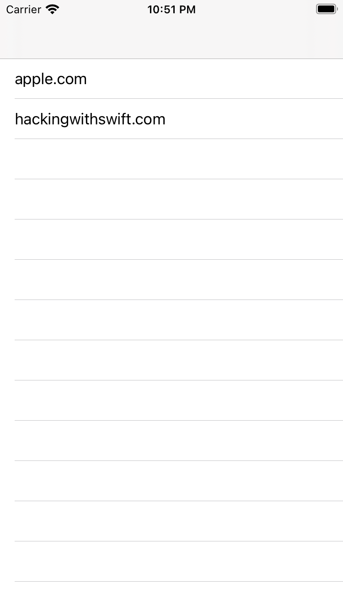
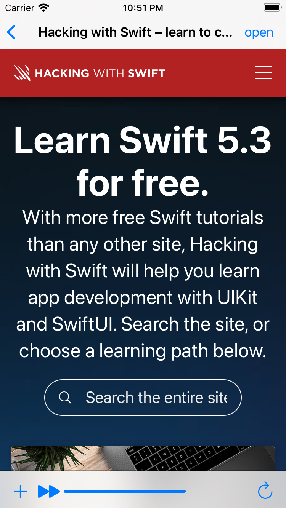
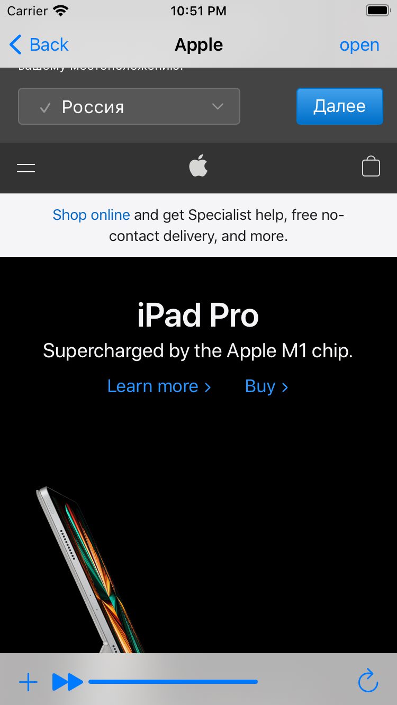

# WebsiteShower
The aplication for implement websites in ios app. 
The app open 2 sites - apple.com and hackingwithswift.com
## Tools to implement the project
  - UIAlertController
  - UIToolbar
  - WKWebWiew
  - UIProgressView
  - Key-value observing
  - LoadView
  - Flexible space
 
 ## Project Screen Shots
 

## More features soon 
- more web sites
- alert for forbiden sites
- text field to enter any site. 
  
## Conclusion 
It was interesting and hard project which helped me to understand how works WebView and how implement it to IOS app.
Even though it was a basic app, it was chalanging for me and takes three days to finish.
I'm satisfied with work i've done and will return to make this up even more beautiful.
